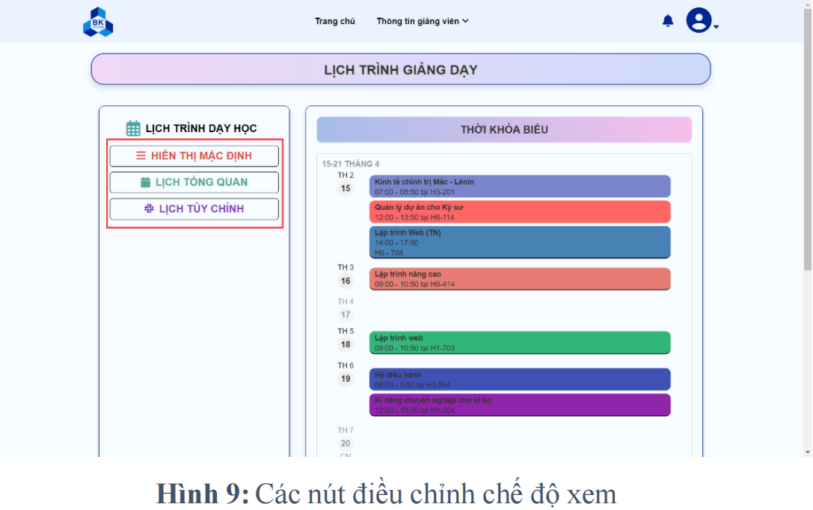
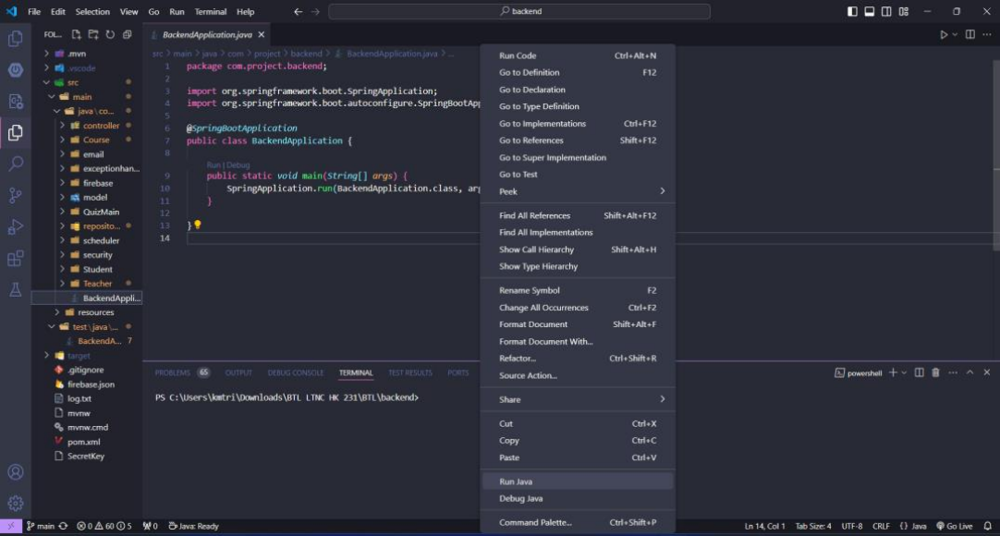

# **Academic Management System - Hệ thống quản lý há»c thuật - LMS**

## 📌 **Introduction**

🎓 With the aim of creating a high-quality learning environment alongside the development of information technology, a software system has been designed to serve as a comprehensive academic management platform. This software provides a variety of conveniences for students and teachers while also acting as an effective interaction platform between students, teachers, and the school. With separate login functions for lecturers and students, the system ensures data security and easy access to necessary information. Additionally, the software offers a user-friendly interface that is easy for everyone to use.

🎓 In the lecturer login sessions, users have the right to access and manage student information. Lecturers can also manage their personal information, degrees, and expertise. The software provides lecturers with the ability to update course content and support student competency assessment through quizzes.

🎓 With the student login function, users can manage their personal information. Furthermore, they have access to their academic progress and grades. The software also enables students to register for or withdraw from courses. To ensure data security, the system only allows users to view their own personal information and grades, preventing access to other students' data.

## 🛠️ **Technologies Used**

🔧 Frontend: HTML, CSS, JavaScript

🔧 Backend: Spring Boot (Java)

🔧 Database: Google Firebase (Firestore, Firebase Storage)

🔧 Security: Spring Security, JWT Authentication

## 🚀 **Source code:**
The source code of the software can be accessed via the following link:

🔗 [Academic Management System](https://github.com/NguyenVu04/BTL.git)

## 📺 **Video Introduction:**
Product introduction video:

🔗 [Academic Management System](https://youtu.be/HpA0xAE15ZE?si=Bu4EhRuMUR9bwU4F)

## 📌**Software Design - Thiết kế phần mềm** 
The software is designed as a web application and is divided into two main parts: `frontend` and `backend`.
### Frontend: 
The frontend is built using HTML, CSS, and JavaScript.
- HTML (Hypertext Markup Language) is a markup language used to create web pages.
- CSS (Cascading Style Sheets) helps style web elements, making them more dynamic and visually appealing.
- JavaScript is a programming language that enables user interaction with the website.

### Backend: 
The backend is implemented using Spring Boot, a Java framework that facilitates web development by providing various built-in features. It is responsible for storing and processing data as well as handling the infrastructure needed for the application to function.

The **`backend`** structure is organized into the following packages and components:
- `model` package: Contains the abstract class `Model`, which is inherited by the `Course`, `Student`, and `Teacher` classes.
- `Course` package: Includes:
  - `Course` class: Stores course-related information.
  - `NameIDStu` class: Stores student results and details related to a specific course.
- `Student` package: Includes:
  - `Student` class: Stores student information.
  - `Gender` class: Stores student gender details.
- `Teacher` package: Includes:
  - `Certificate` class: Represents the certifications and degrees of lecturers.
  - `Teacher` class: Stores lecturer information.
- `QuizMain` package: Enhances the effectiveness of student assessments, allowing lecturers to create online quizzes easily.
- `firebase` package: Integrates Google Firebase as the database.
- `repository` package: Contains:
  - `BackendStorage` and `FirestoreRepository` classes: Handle interactions with Firebase Storage and Firestore Database.
- `security` package: Implements Spring Security authentication mechanisms. It includes the following classes:
  - `JwtAuthenticationFilter`: Defines a filter to process JWT-based authentication requests.
  - `UserRole`: Defines user roles and privileges in the system.
  - `BackendSecurityConfiguration`: Configures JWT authentication filtering and authentication mechanisms for the backend.
  - `BackendDetailsService`: Provides services such as retrieving user information for database interactions.
  - `JwtUtils`: Contains functions for handling JWT tokens (encoding, decoding, extracting data, etc.).
  - `BackendAuthenticationProvider`: Implements an authentication mechanism using email and password.
  - `AuthenticationDetails`: Defines the authentication data structure stored in the database.
The system uses JWT (JSON Web Token) for encryption and authentication.
- `exceptionhandler` package: Handles system exceptions.
- `controller` package:
  - Handles requests from the frontend and returns corresponding responses.
  - Processes user actions, such as login requests, course registrations, and quiz submissions.
  - Includes the following controllers:
      - `AuthenticationController`: Handles login, registration, and authentication.
      - `TeacherController`: Manages lecturer-related operations (view, update, delete information).
      - `StudentController`: Manages student-related operations (view, update, delete information).
      - `QuizController`: Manages quiz-related tasks (adding, modifying questions, creating quizzes, grading, viewing scores, etc.).
      - `CourseController`: Handles course-related actions (adding/removing lecturers and students, updating course content, viewing scores, adding materials and lectures).

**`Frontend Structure`**
The frontend consists of the graphical user interface (GUI) that users interact with. It is stored in the fe directory, which contains the following HTML files:
- `course-detail.html`: Displays course details, including general information, announcements, lecture slides, reference materials, and quizzes.
- `course-score.html`: Displays student scores (for students only), including grade tables and progress tracking.
- `courses.html`: Lists enrolled courses, allowing students to register for new courses or drop existing ones using buttons.
- `index.html`: The homepage, featuring an image carousel and general school information.
- `list_stu.html`: Displays the class list for a specific course.
- `login.html`: Handles user login and registration. It supports separate login options for lecturers and students, requiring email and password authentication.
- `quiz.html`: Enables lecturers to create and manage quizzes for students.
- `student-info.html`: Displays student personal information and provides options for editing personal details.
- `teacher_classlist.html`: Lists the classes assigned to a lecturer.
- `teacher_evaluate.html`: Allows lecturers to update student grades and provide evaluations.
- `teacher_host.html`: Stores and updates lecturer information.
- `teacher-info.html`: Displays a list of all lecturers in the institution.
- `teacher_lich.html`: Shows the lecturer's teaching schedule. Users can adjust the display mode for better viewing.
- `assets` folder:
  - Stores CSS, JavaScript, images, and other design-related files.
  - Enhances the visual appearance and user interactions (fonts, navigation menus, buttons, images, graphs).
This detailed structure ensures that the academic management system is well-organized and functional, providing secure and efficient interactions between students, lecturers, and the institution.

## 📌**Class Diagram** 

## 📌**Software Features - Các tính năng của phần mềm**

**1. Login:**

On the login interface, users are provided with two options: Lecturer Login and Student Login.

Figure 1: Login Options

For both options, users are provided with the corresponding interface to enter their email and password.

Figure 2: Login Page for Each Role

Note: Each email corresponds to a specific account type. Users cannot use a lecturer’s email to log in as a student or vice versa.

The system also provides users with a logout feature.

Figure 3: Logout Option

Below are two sample accounts for lecturers and students to test the system's features:
- Lecturer Account:
  - Email: giangvien@hcmut.edu.vn
  - Password: gv@2111
- Student Account:
  - Email: sinhvien@hcmut.edu.vn
  - Password: sv@2213089

**2. Features for Lecturers:**

On the homepage of the lecturer login session, when users hover over the "Lecturer Information" section, several options appear. Clicking on any option will redirect the user to the corresponding web page.

Figure 4: Available Options for Lecturers

- Lecturer Information:
  - Clicking on "Lecturer Information" in Figure 4 redirects users to a webpage displaying information about lecturers currently teaching at the university.

Figure 5: Lecturer Information Page

- Personal Information:
  - Clicking on "Personal Information" in Figure 4 redirects users to a webpage containing their personal details.

Figure 6: Lecturer's Personal Information Page

  - Users can edit their personal information by clicking on "Edit Information," which will open a popup window.

Figure 7: Edit Personal Information

  - Here, users can fill in the required fields and click "Save" to update their personal details.

- Teaching Schedule:
  - Clicking on "Teaching Schedule" in Figure 4 will display the lecturer's teaching schedule.

Figure 8: Teaching Schedule Page

  - Users can adjust the viewing mode using the buttons highlighted in red below.

Figure 9: Viewing Mode Adjustment Buttons

- Class List:
  - Clicking on "Class List" in Figure 4 redirects users to a webpage displaying the courses they are teaching.

Figure 10: List of Courses Being Taught

  - Here, users can click on "CLASS LIST" to view the list of students in a specific course.

Figure 11: Student List and Evaluation

  - In the student list, users can evaluate students' scores by clicking on "Evaluate" next to a student's name.

  - In Figure 10, users can click on "EDIT COURSE" for the respective course.

Figure 12: Course Management Interface

  - In this section, users will see the course interface for the selected course. Scrolling down, they will find three key sections that allow them to modify course content.

Figure 13: Editable Sections

  - Users can upload lecture slides and reference materials by selecting appropriate files and clicking "Update." Additionally, users can create quizzes in the "Quiz Test" section.

**3. Features for Students:**

Figure 14: Student Login Homepage

- Lecturer Information:
  - Similar to the lecturer login session, clicking on "Lecturer Information" will redirect the user to the webpage shown in Figure 5.

- Student Information:
  - On the student login homepage, hovering over "Student Information" reveals several options.

Figure 15: Student Information Options

  - Clicking on "Personal Information" redirects users to a new webpage.

Figure 16: Student's Personal Information Page

  - Here, users can review and edit their personal information.

Figure 17: Edit Student Personal Information

  - Additionally, students can click on "Learning Progress" and "Grades" to track their academic progress and scores.

Figure 18: Learning Progress Statistics

Figure 19: Course Grades

- My Courses:
  - When users hover over "My Courses," several options appear.

Figure 20: My Courses Options

  - Clicking on "Course List" redirects users to a webpage containing the list of enrolled courses.

Figure 21: Enrolled Course List

  - The webpage also provides a tool for quickly searching for courses. Additionally, scrolling down reveals a control panel that allows users to register or drop courses. Users can refer to Figure 10 for available courses.

Figure 22: Course Management Panel

  - Similar to the lecturer login session, clicking on "Course Details" in Figure 21 redirects users to the corresponding course interface.

Figure 23: Course Interface

  - However, unlike the lecturer login session, students cannot modify the three sections: "Lecture Slides," "Reference Materials," and "Quiz Tests."

Figure 24: Study Materials and Quizzes for Students

  - Furthermore, users can click on "Class List" or "Progress Scores" in Figure 23 to view the list of students enrolled in the class and their own scores. Unlike lecturers, students cannot evaluate the learning progress of other students.

Figure 25: Class List and Personal Scores

## 📌**Software Execution Guide - Hướng dẫn chạy phần mềm**
- Step 1: Open two IDE windows to run the application. In the first IDE window, open the backend folder.

- Step 2: Locate the file "BackendApplication.java".

- Step 3: Right-click on the file and select Run Java (or an equivalent function if using a different IDE) and wait for it to run successfully.

- Step 4: In the second IDE window, open the fe folder. (From this step onward, instructions are specifically for VS Code users. If you use a different IDE, find the appropriate way to run the frontend.)
🔹 Note: Make sure to install the Live Server extension.

- Step 5: Locate the index.html file. Then, right-click on the code inside the file and select Open with Live Server to launch the system's homepage.

## 🏆 Contributors
This project was successfully developed thanks to the dedication and effort of the following contributors:
1. Võ Quang Đại Việt - 2213954
2. Nguyễn Đình Đức - 2210794
3. Nguyễn Duy Vũ - 2213997
4. Trần Huy Đức - 2210812
5. Chế Minh Đức - 2210783
6. Khúc Minh Trí - 2213636
7. Nguyễn Quang Sáng - 2212922

🎉🎉🎉 Thank you for checking out this project! 🚀

